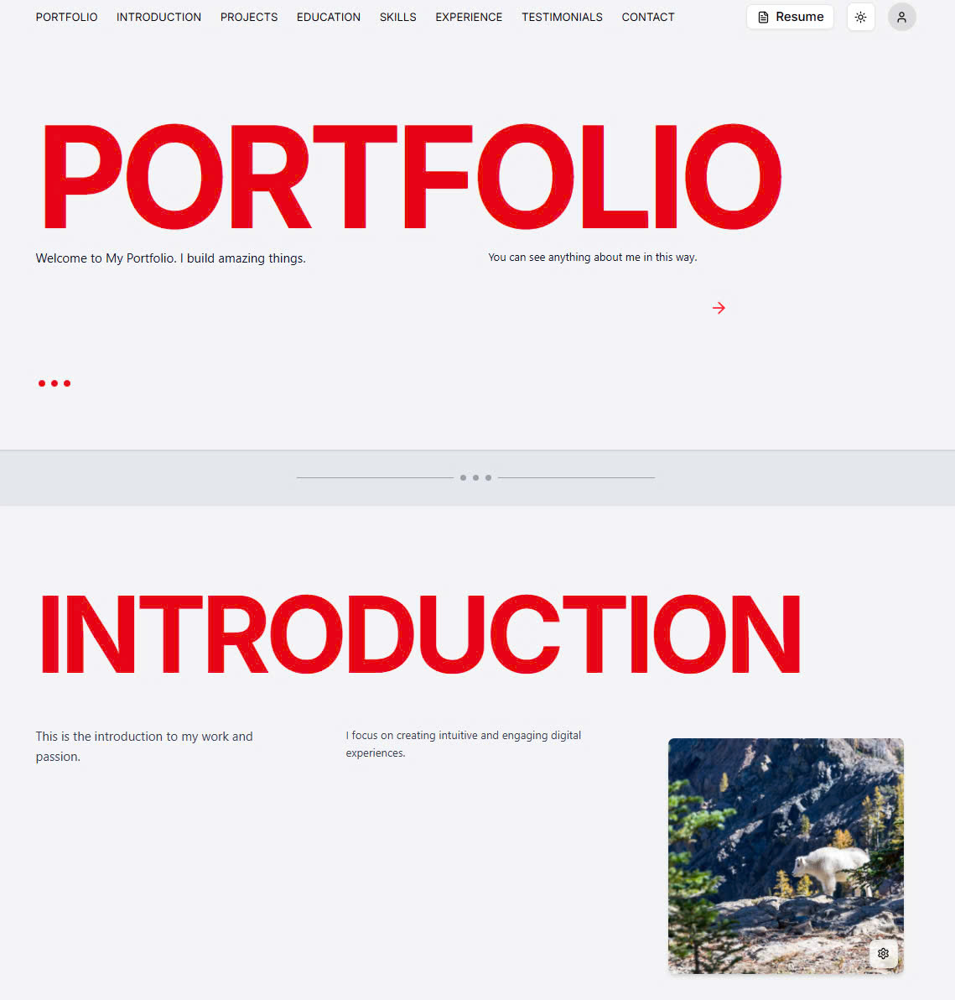
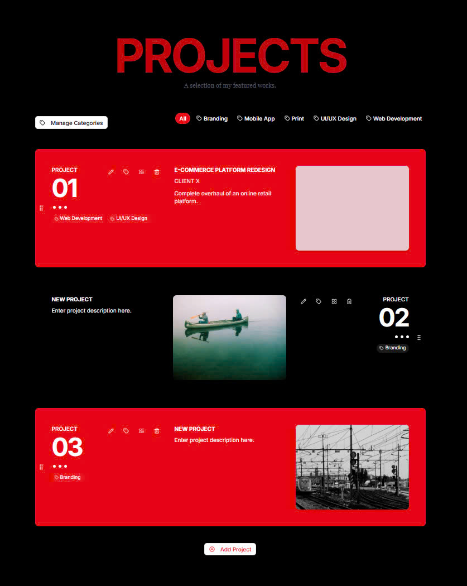
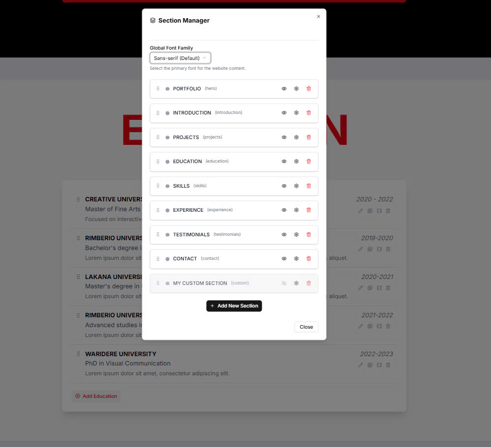
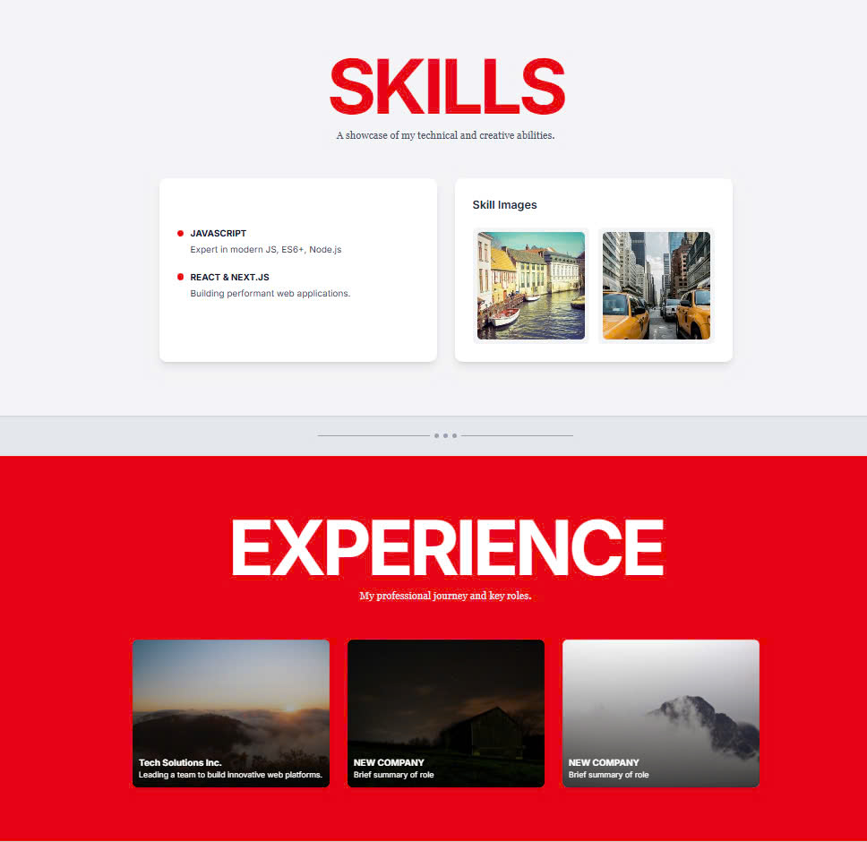
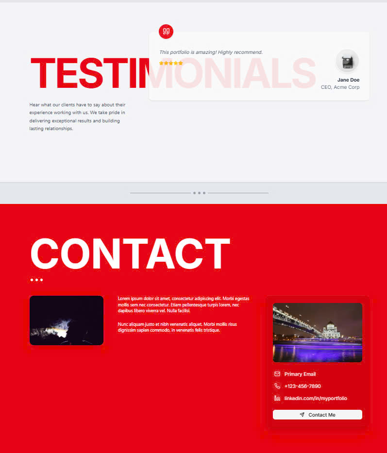

# Portfolio Create Project

Welcome to the **Portfolio Create** project! This is a modern, full-featured portfolio builder and manager, designed to help you showcase your work, skills, and experience with ease. You can try the live demo and even log in as an admin to explore all features.

## 🚀 Live Demo

Try it now: [https://trunghau-portfolio-create.vercel.app/](https://trunghau-portfolio-create.vercel.app/)

**Admin Login:**
- Email: `ntthau0963@gmail.com`
- Password: `Ntth@0963`

---

## ✨ Key Features

- **Full CRUD Operations**: Create, Read, Update, and Delete for all portfolio sections (Projects, Education, Skills, Experience, Testimonials, Contact, and more).
- **Section Manager**: Easily reorder, show/hide, and customize sections. Add new custom sections as needed.
- **Category Management**: Organize projects by categories and filter them dynamically.
- **Rich Content Blocks**: Support for text, images, and custom content blocks in each section.
- **Authentication & Authorization**: Secure login for admin users. Only admins can manage content.
- **Responsive Design**: Fully responsive and optimized for all devices.
- **Modern UI/UX**: Clean, professional, and highly customizable interface.
- **Database Integration**: All data is stored and managed via a robust database using Prisma ORM.
- **Seeding & Demo Data**: Comes with demo data for instant preview and testing.

---

## 📸 Screenshots

**Home & Introduction**

**Projects Section**

**Section Manager**

**Experience & Testimonials**

---

## 🛠️ Main Libraries & Technologies

- **Next.js** – React framework for server-side rendering and routing
- **Prisma** – Modern ORM for database access and migrations
- **MongoDB** – Flexible NoSQL database (can be swapped for other DBs with Prisma)
- **bcryptjs** – Secure password hashing
- **Cloudinary** – Image upload and management (optional, for image blocks)
- **TypeScript** – Type safety across the codebase
- **Tailwind CSS** – Utility-first CSS framework for rapid UI development

---

## 📂 Project Structure

- `/app/api/` – API routes for all CRUD operations
- `/prisma/` – Prisma schema and seed scripts
- `/lib/` – Prisma client and utility libraries
- `/components/` – React components for UI

---

## 📝 How to Use

1. Visit the [live demo](https://trunghau-portfolio-create.vercel.app/)
2. Log in as admin using the credentials above
3. Explore the admin features: add/edit/delete sections, projects, skills, etc.
4. Customize your portfolio and see changes in real time

---

## 📧 Contact

For questions or feedback, please contact the project maintainer.

---

Enjoy building your portfolio!
